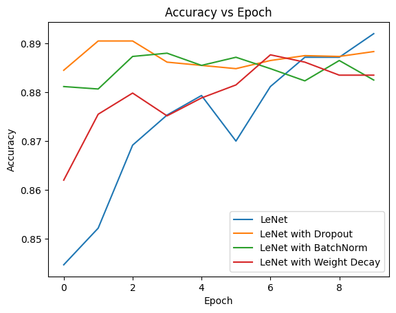
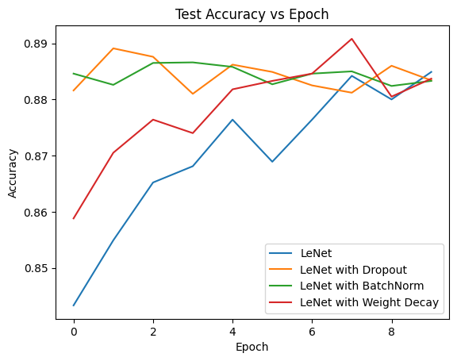

# Assignment 1

- Emin Alp Arslan (eaa86)
- Mingshu Liu

## How to run
The notebook was run on Google Colab.
The first two cells will download the dependencies and the dataset.
Each variation of the model has its own cell and training/testing cells.
The notebook can be run top to bottom to train and test, with the summary graph produced at the end.

## Architecture
We used a LeNet-like architecture with these changes:
- ReLU activations instead of sigmoid
- Dropout (p=0.2) between hidden linear layers
    - We tried with dropout (p=0.5) and dropout (p=0.8), but 0.2 worked better
- Batch normalization between all layers
- Weight decay with a coefficient of 1e-4
    - We tried with a coefficient of 1e-3, but this decreased the accuracy

## Hyperparameters
- Learning rate: 1e-3
    - We experimented with other rates like 1e-2, a smaller rate was better
- Number of epochs: 10
    - The models converged after around 7 epochs, but we stopped training after 10 epochs
- Batch size: 64
- We used the Adam optimizer since it is the most ubiquitous optimizer
- We used 10% of the training data for validation
- Everything else was left at the default values (for the optimizer, loss, etc.)

## Convergence graphs

## Accuracies

| Epoch      | LeNet | Dropout | BatchNorm | Weight Decay |
| ---------- | ----- | ------- | --------- | ------------ |
| 1 (train)  | 0.845 | 0.8845  | 0.8812    | 0.8620       |
| 2 (train)  | 0.852 | 0.8905  | 0.8807    | 0.8755       |
| 3 (train)  | 0.869 | 0.8905  | 0.8873    | 0.8798       |
| 4 (train)  | 0.875 | 0.8862  | 0.8880    | 0.8752       |
| 5 (train)  | 0.879 | 0.8855  | 0.8855    | 0.8788       |
| 6 (train)  | 0.870 | 0.8848  | 0.8872    | 0.8715       |
| 7 (train)  | 0.881 | 0.8865  | 0.8848    | 0.8877       |
| 8 (train)  | 0.887 | 0.8875  | 0.8823    | 0.8862       |
| 9 (train)  | 0.887 | 0.8873  | 0.8865    | 0.8835       |
| 10 (train) | 0.892 | 0.8883  | 0.8825    | 0.8835       |
| 1 (test)   | 0.843 | 0.8816  | 0.8846    | 0.8588       |
| 2 (test)   | 0.855 | 0.8891  | 0.8826    | 0.8705       |
| 3 (test)   | 0.865 | 0.8876  | 0.8865    | 0.8764       |
| 4 (test)   | 0.868 | 0.8810  | 0.8866    | 0.8740       |
| 5 (test)   | 0.876 | 0.8862  | 0.8858    | 0.8818       |
| 6 (test)   | 0.869 | 0.8849  | 0.8827    | 0.8833       |
| 7 (test)   | 0.876 | 0.8825  | 0.8846    | 0.8846       |
| 8 (test)   | 0.884 | 0.8812  | 0.8850    | 0.8908       |
| 9 (test)   | 0.880 | 0.8860  | 0.8824    | 0.8805       |
| 10 (test)  | 0.885 | 0.8834  | 0.8833    | 0.8837       |

## Conclusions

The regularization techniques help the network converge faster, but the accuracies after 10 epochs were similar between the different models on both the training and the test sets. Dropout especially boosted the accuracy of the model after just a single epoch. The same trends are seen on the test and training sets: dropout and batch normalization converge extremely quickly even after just a single epoch, while weight decay helps a little, converging to the final accuracy slightly faster than the default LeNet model.

