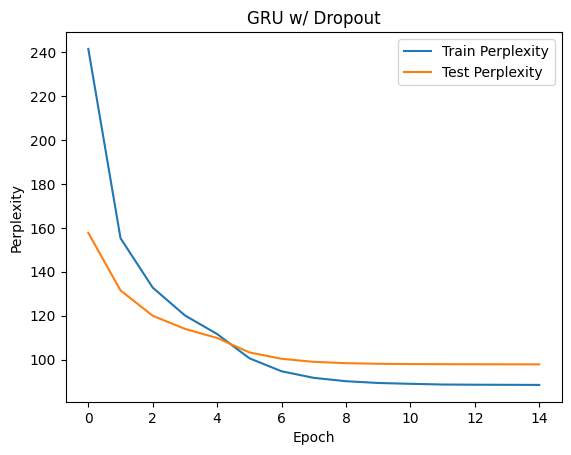

# Assignment 2

- Emin Alp Arslan (eaa86)
- Mingshu Liu

## How to run
The notebook was run on Google Colab.
The path to the dataset should be changed appropriately.
Each variation of the model has its own cell and training/testing cells.
The notebook can be run top to bottom to train and test, with the graphs created along the way.

## Architecture
We used LSTM and GRU models with the following architecture:
- Embedding layer with 200 dimensions
- Two layers of LSTM/GRU with 200 hidden dimensions each
- Dropout (p=0.25) on the LSTM/GRU layers and before the Linear layer for the regularized models
    - We tried with dropout (p=0.5), but 0.25 worked better

## Hyperparameters
- Learning rate: Starting with 2, and halving every epoch after 4 epochs
    - We experimented with other rates like 1&4 and different learning rate schedules
- Number of epochs: 15
    - The models converged after around 13 epochs, but we stopped training after 15 epochs
- Gradient clipping: 5
- Batch size: 20
- Sequence length: 20
- We used SGD optimizer since that is what was used in the paper
- Everything else was left at the default values (for the optimizer, loss, etc.)

## Convergence graphs

## Accuracies

### Train perplexities

| Epoch | LSTM  | GRU    | LSTM Dropout | GRU Dropout |
| ----- | ----- | ------ | ------------ | ----------- |
| 1     | 248.2 | 216.5  | 266.2        | 241.5       |
| 2     | 139.0 | 129.3  | 159.8        | 155.3       |
| 3     | 110.7 | 105.4  | 133.1        | 132.8       |
| 4     | 95.1  | 91.7   | 118.6        | 120.1       |
| 5     | 84.6  | 82.2   | 108.9        | 111.6       |
| 6     | 72.5  | 70.5   | 98.3         | 100.6       |
| 7     | 65.9  | 64.4   | 92.5         | 94.7        |
| 8     | 62.5  | 61.3   | 89.6         | 91.7        |
| 9     | 60.6  | 59.6   | 88.1         | 90.2        |
| 10    | 59.6  | 58.6   | 87.3         | 89.3        |
| 11    | 59.0  | 58.1   | 86.9         | 89.0        |
| 12    | 58.7  | 57.8   | 86.6         | 88.6        |
| 13    | 58.6  | 57.7   | 86.5         | 88.6        |
| 14    | 58.5  | 57.6   | 86.4         | 88.5        |
| 15    | 58.4  | 57.6   | 86.4         | 88.5        |

### Val perplexities

| Epoch | LSTM  | GRU    | LSTM Dropout | GRU Dropout |
| ------| ----- | ------ | ------------ | ----------- |
| 1     | 165.9 | 151.6  | 173.3        | 163.6       |
| 2     | 132.5 | 128.2  | 140.3        | 137.5       |
| 3     | 120.3 | 119.3  | 125.0        | 125.6       |
| 4     | 114.6 | 114.9  | 116.4        | 119.0       |
| 5     | 111.8 | 112.5  | 110.7        | 114.5       |
| 6     | 107.2 | 106.2  | 104.6        | 107.8       |
| 7     | 104.8 | 102.0  | 101.6        | 104.6       |
| 8     | 103.5 | 100.7  | 100.2        | 103.2       |
| 9     | 102.9 | 100.4  | 99.5         | 102.7       |
| 10    | 102.7 | 100.1  | 99.3         | 102.4       |
| 11    | 102.6 | 100.0  | 99.2         | 102.3       |
| 12    | 102.5 | 99.9   | 99.1         | 102.2       |
| 13    | 102.4 | 99.9   | 99.1         | 102.2       |
| 14    | 102.4 | 99.9   | 99.1         | 102.2       |
| 15    | 102.4 | 99.9   | 99.1         | 102.2       |

### Test perplexities

| Epoch | LSTM  | GRU    | LSTM Dropout | GRU Dropout |
| ------| ----- | ------ | ------------ | ----------- |
| 1     | 161.3 | 149.7  | 168.3        | 157.7       |
| 2     | 129.3 | 125.7  | 134.7        | 131.5       |
| 3     | 116.8 | 116.7  | 120.4        | 120.0       |
| 4     | 110.6 | 112.8  | 111.4        | 114.0       |
| 5     | 107.7 | 111.3  | 106.3        | 109.8       |
| 6     | 103.1 | 105.7  | 100.4        | 103.3       |
| 7     | 100.8 | 103.0  | 97.4         | 100.4       |
| 8     | 99.5  | 101.8  | 95.9         | 99.0        |
| 9     | 98.8  | 101.3  | 95.3         | 98.4        |
| 10    | 98.4  | 101.1  | 95.0         | 98.1        |
| 11    | 98.3  | 101.0  | 94.8         | 98.0        |
| 12    | 98.2  | 100.9  | 94.7         | 97.9        |
| 13    | 98.1  | 100.9  | 94.7         | 97.9        |
| 14    | 98.1  | 100.9  | 94.7         | 97.9        |
| 15    | 98.1  | 100.9  | 94.7         | 97.8        |

