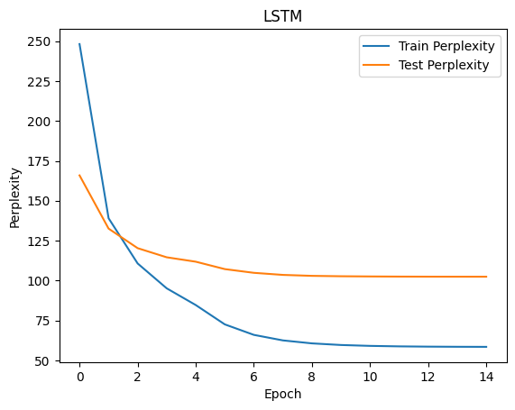
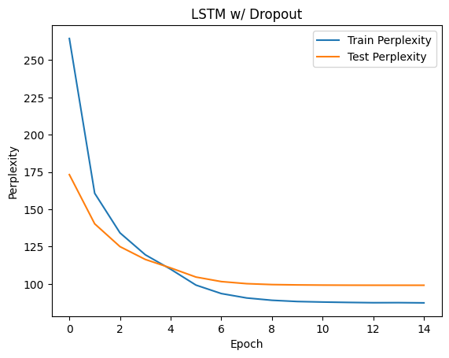

# Assignment 2

- Emin Alp Arslan (eaa86)
- Mingshu Liu

## How to run
The notebook was run on Google Colab.
The path to the dataset should be changed appropriately.
Each variation of the model has its own cell and training/testing cells.
The notebook can be run top to bottom to train and test, with the graphs created along the way.

## Architecture
We used LSTM and GRU models with the following architecture:
- Embedding layer with 200 dimensions
- Two layers of LSTM/GRU with 200 hidden dimensions each
- Dropout (p=0.25) on the LSTM/GRU layers and before the Linear layer for the regularized models
    - We tried with dropout (p=0.5), but 0.25 worked better

## Hyperparameters
- Learning rate: Starting with 2, and halving every epoch after 4 epochs
    - We experimented with other rates like 1&4 and different learning rate schedules
- Number of epochs: 15
    - The models converged after around 13 epochs, but we stopped training after 15 epochs
- Gradient clipping: 5
- Batch size: 20
- Sequence length: 20
- We used SGD optimizer since that is what was used in the paper
- Everything else was left at the default values (for the optimizer, loss, etc.)

## Convergence graphs

## Accuracies

### Train perplexities

| Epoch | LSTM  | GRU    | LSTM Dropout | GRU Dropout |
| ----- | ----- | ------ | ------------ | ----------- |
| 1     | 279.8 | 362.8  | 452.4        | 406.4       |
| 2     | 213.8 | 203.4  | 259.3        | 247.4       |
| 3     | 189.l | 162.4  | 210.9        | 208.0       |
| 4     | 177.1 | 139.2  | 185.2        | 186.6       |
| 5     | 170.5 | 123.4  | 168.4        | 172.5       |
| 6     | 163.5 | 104.0  | 150.3        | 153.6       |
| 7     | 160.2 | 94.2   | 140.8        | 143.9       |
| 8     | 158.4 | 89.1   | 136.0        | 138.7       |
| 9     | 157.5 | 86.3   | 133.6        | 136.1       |
| 10    | 157.0 | 84.8   | 132.0        | 134.9       |
| 11    | 156.9 | 84.0   | 131.2        | 134.3       |
| 12    | 156.8 | 83.6   | 131.1        | 133.8       |
| 13    | 156.7 | 83.3   | 130.7        | 133.6       |
| 14    | 156.7 | 83.2   | 130.7        | 133.5       |
| 15    | 156.7 | 83.1   | 130.6        | 133.6       |

### Val perplexities

| Epoch | LSTM  | GRU    | LSTM Dropout | GRU Dropout |
| ------| ----- | ------ | ------------ | ----------- |
| 1     | 430.7 | 248.5  | 287.0        | 260.2       |
| 2     | 229.1 | 203.5  | 220.9        | 213.5       |
| 3     | 176.7 | 187.3  | 194.5        | 194.2       |
| 4     | 148.8 | 180.8  | 179.0        | 183.0       |
| 5     | 130.5 | 178.7  | 169.2        | 175.9       |
| 6     | 110.2 | 170.0  | 159.7        | 165.5       |
| 7     | 99.4  | 165.8  | 155.0        | 160.7       |
| 8     | 93.7  | 163.8  | 152.6        | 158.5       |
| 9     | 90.7  | 162.9  | 151.6        | 157.5       |
| 10    | 89.1  | 162.6  | 151.1        | 157.1       |
| 11    | 88.2  | 162.4  | 151.0        | 156.9       |
| 12    | 87.7  | 162.3  | 150.9        | 156.8       |
| 13    | 87.5  | 162.3  | 150.8        | 156.8       |
| 14    | 87.3  | 162.3  | 150.8        | 156.8       |
| 15    | 87.2  | 162.3  | 150.8        | 156.8       |
